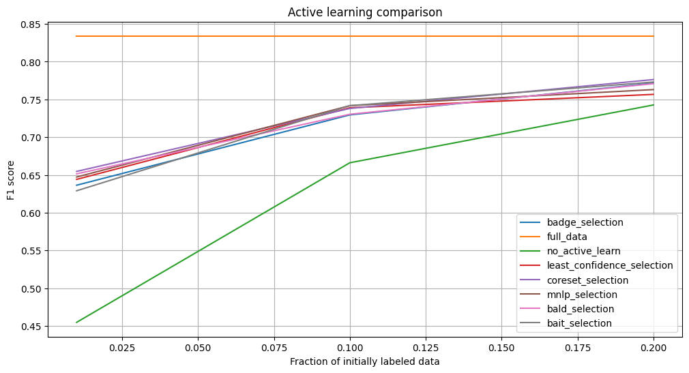

# Курсовая работа
## Активное обучение

В данной работе реализованы и проверены следующие алгоритмы активного обучения:
* Least Confidence (LC)
* Coreset
* Maximum Normalized Log-Probability (MNLP)
* BADGE (Batch Active learning by Diverse Gradient Embedding)
* BAIT (Batch Active learning via Information maTrice)
* BALD (Bayesian Active Learning by Disagreement)

Также было произведено обучение модели без на всех данных и на части выборки без использования активного обучения.

Для работы был выбран датасет CIFAR10. В качестве базовой модели взяли предобученный EfficientNet-b0.

Описание алгоритмов и их реализация приведена в ноутбуке

### Результаты

