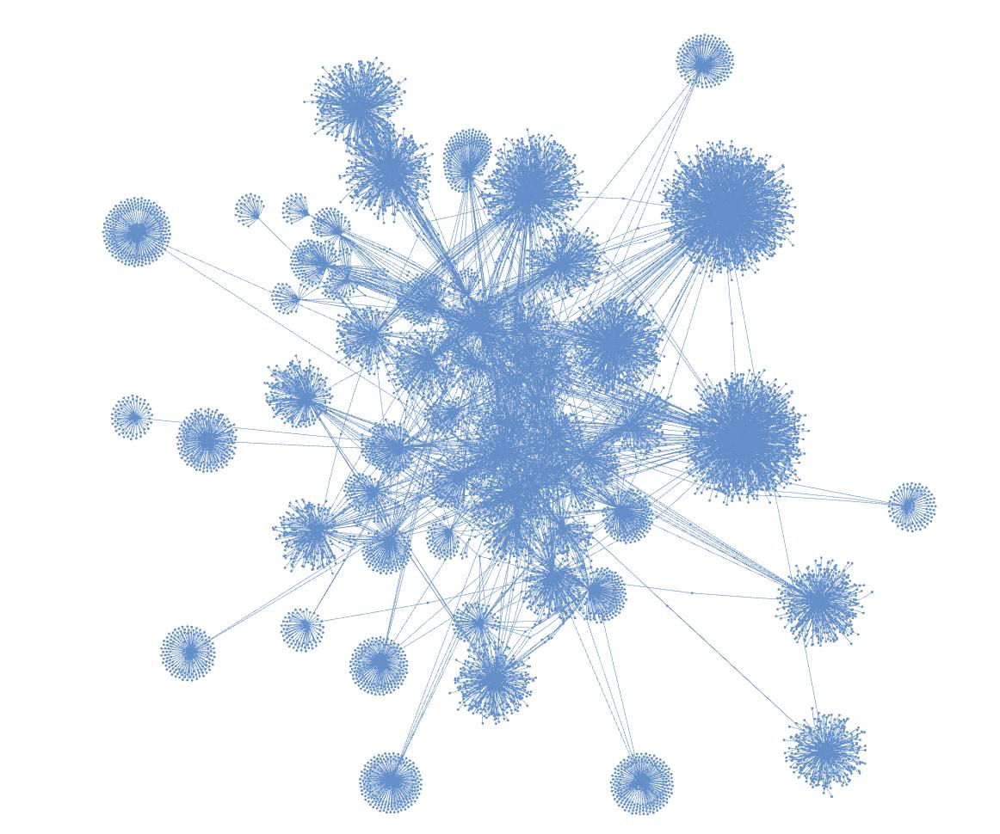

# Лабораторная работа 1

### Задание

1. Собрать информацию о друзьях и друзьях друзей из VK для членов группы
2. Оценить центральность: по посредничеству, по близости, собственного вектора

### Структура работы

**parse_friends.py** - скрипт для создания графа друзей и друзей друзей и его визуализации  
**lab1.ipynb** - подсчет центральности для членов группы

### Полученный граф

### Результаты вычисления центральности

