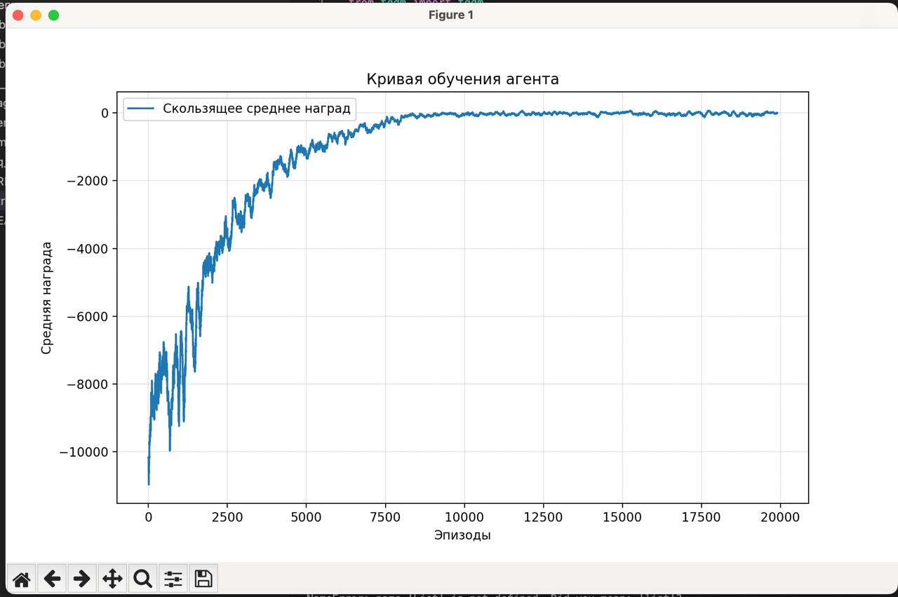

# Tic Tac Toe Reinforcement Learning

Этот проект реализует среду игры в крестики-нолики и обучает агента с использованием алгоритма Q-обучения. Агенты обучаются через взаимодействие с окружением, и результаты обучения визуализируются с помощью графиков.

## Структура проекта

### 1. `environment.py`

Этот файл содержит класс `TicTacToeEnv`, который реализует среду игры в крестики-нолики. Класс включает в себя следующие методы:

- `__init__(self, board_size: int)`: Инициализирует игровую среду с заданным размером доски.
- `_create_empty_board(self)`: Создает пустое игровое поле.
- `_encode_player(self, player: str)`: Кодирует символ игрока в числовое представление.
- `_decode_player(self, code: int)`: Декодирует числовое представление в символ игрока.
- `_get_board_state(self)`: Возвращает закодированное состояние доски.
- `reset(self, seed=None, options=None)`: Сбрасывает состояние игры.
- `_is_winning_move(self, player: str, row: int, col: int)`: Проверяет, является ли ход выигрышным.
- `step(self, action: int)`: Выполняет действие и возвращает новое состояние, награду и информацию о завершении игры.
- `render(self)`: Отображает текущее состояние игры.

### 2. `agent.py`

Этот файл содержит класс `QLearningAgent`, который реализует агента, использующего алгоритм Q-обучения. Класс включает в себя методы для выбора действий, обновления Q-таблицы и управления параметрами обучения.

### 3. `training.py`

Этот файл содержит функции для обучения агента:

- `plot_learning_curve(rewards, window_size=1000)`: Отображает график обучения с использованием скользящего среднего.
- `train_agent(board_size: int, n_episodes: int = 100_000, verbose=True)`: Обучает агента, взаимодействуя со средой. Возвращает обученного агента, историю наград и количество ходов.

### 4. `main.py`

Этот файл является основной точкой входа в проект. Он запускает процесс обучения и отображает финальную статистику:

- `main()`: Запускает обучение агента и выводит статистику по результатам.

## Установка и запуск

1. Убедитесь, что у вас установлен Python 3.x.
2. Установите необходимые библиотеки:
   ```bash
   pip install numpy matplotlib tqdm gymnasium
3. Запустите обучение:
   ```
   python main.py

## Использование
После запуска `main.py`, агент начнет обучаться, и вы сможете наблюдать за процессом обучения через прогресс-бар. В конце обучения будет выведена статистика, включая среднюю награду и среднее количество ходов за последние 1000 эпизодов.

## Кривая обучения

