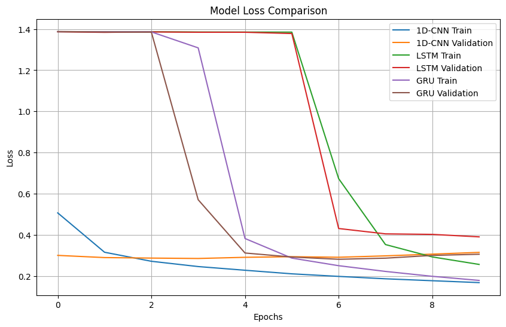

## Лабораторная работа № 4

Задание:
1. Модель должна научиться классифицировать текст
2. Должны выполнены три реализации модели. Реализации должны быть основаны на использовании:
    - одномерной сверточной нейросети
    - рекуррентной нейросети LSTM
    - рекуррентной нейросети GRU
3. Выполнить сравнение полученных результатов и сделать вывод

Исходные данные:
- для обучения: https://github.com/mhjabreel/CharCnn_Keras/raw/master/data/ag_news_csv/train.csv
- для тестирования: https://github.com/mhjabreel/CharCnn_Keras/raw/master/data/ag_news_csv/test.csv
- имена классов: https://raw.githubusercontent.com/mhjabreel/CharCnn_Keras/master/data/ag_news_csv/classes.txt

## Результаты

Accuracy

Loss

|Модель  |Время обучения  |Тестовая точность  |Комментарии|
|-------|----------------|-------------------|------------|
|1D-CNN  |Быстро  |89.28%  |Хорошая точность, минимальное время.|
|LSTM  |Медленно  |89.71%  |Требуется больше эпох оптимизации для достижения лучшей точности.|
|GRU  |Средне  |90.45%  |Хороший баланс точности и времени.|

Выводы:
* Если приоритетом является скорость обучения: использовать 1D-CNN
* Если требуется лучшая обработка временной зависимости текста: использовать GRU (вместо LSTM, так как GRU обучается быстрее и показывает аналогичные результаты)
* Если точность ниже 90% критична: рассмотреть увеличение числа эпох для LSTM/GRU или эксперименты с гиперпараметрами